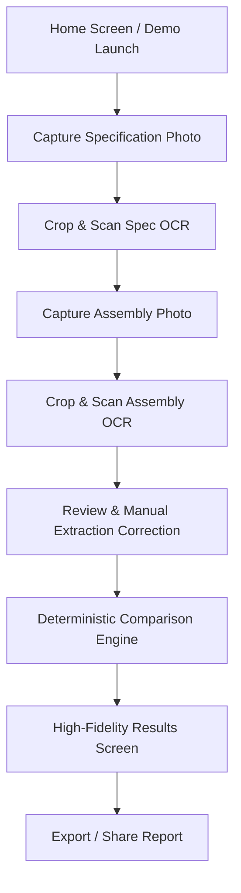

# Parity — Modern Offline Equipment & Assembly Verification

**Parity** is a modern, high-performance Flutter mobile application designed for deterministic, 100% offline verification of physical board assemblies (MCBs, ICs, breadboards, electrical panels) against specification sheets.

Built with Google ML Kit's on-device OCR, Parity operates completely air-gapped with zero network calls, guaranteeing zero data leakage and instantaneous analysis.

---

## Key Features

- 🎨 **Modern Material 3 Aesthetic**: Sleek Indigo/Slate/Emerald design system with rounded glassmorphic cards, subtle drop shadows, fluid entrance animations, and micro-interactions.
- ⚡ **100% Offline & Private**: All image processing and OCR text recognition occur strictly on-device using native Google ML Kit.
- 🎯 **Spatial Row Parsing**: Groups OCR text blocks into rows by Y-centre (tolerance = half the median block height), then pairs the leftmost block as the position and the next as the component — stray text sharing a row's height (part numbers, colour codes) is reported as ignored noise rather than corrupting the reading.
- 🔍 **Interactive Noise & Cropping Control**: Built-in visual slider controls allow operators to trim unnecessary noise, inspect unparsed text lines, and preview parsed items in real time.
- 🧪 **Bundled Real-Photo Demo Mode**: Includes pre-loaded real-world MCB distribution board sample images for instant stage demonstration without needing a live hardware panel.
- 📊 **Deterministic Discrepancy Engine**: Classifies component differences into four precise states (`missing`, `unexpected`, `mismatched`, `unread`) and generates human-readable diagnostic summaries.
- 📄 **Exportable Reports**: Generates structured summary reports ready for sharing or record-keeping.

---

## App Workflow



1. **Home Screen**: Launch live camera verification or select "Run Demo Sample".
2. **Capture Specification**: Capture or select specification sheet photo with interactive crop sliders.
3. **Capture Assembly**: Capture physical assembly panel/board photo.
4. **Review Extraction**: Verify detected items, manually adjust unread components, or include ignored OCR text lines.
5. **Results Screen**: View color-coded discrepancy breakdown, confidence scores, and natural-language summary.

---

## Directory Structure

```
lib/
├── logic/
│   ├── ocr.dart                  # On-device ML Kit OCR runner
│   ├── parser.dart               # Row-grouping + position/component pairing
│   ├── image_crop.dart           # Pixel crop applied before OCR (dart:ui only)
│   ├── compare.dart              # PURE — core 4-state discrepancy engine, no model
│   └── phrase.dart               # Deterministic natural-language summary builder
├── models/
│   ├── diff_result.dart          # Discrepancy data contracts (4 states)
│   └── spec_item.dart            # Spec item model with confidence tracking
├── io/
│   └── report.dart               # Report file write + clipboard export
├── screens/
│   ├── capture_screen.dart       # Camera capture, crop, and OCR status/diagnostics
│   ├── review_extraction_screen.dart # Expected vs. observed manual correction list
│   └── results_screen.dart       # Colour-coded discrepancy summary + export
└── main.dart                     # App entry point, Home screen, Material 3 theme
```

---

## Getting Started

### Prerequisites
- [Flutter SDK](https://docs.flutter.dev/get-started/install) (v3.27.0 or newer)
- Android Studio / VS Code with Flutter extension
- Physical Android device (Android 8.0 / SDK 26+) connected via USB

### Installation & Run

1. **Clone the repository:**
   ```bash
   git clone https://github.com/RizzuSkh/IQOO.git
   cd IQOO
   ```

2. **Fetch dependencies:**
   ```bash
   flutter pub get
   ```

3. **Run unit & widget tests:**
   ```bash
   flutter test
   ```

4. **Deploy to connected Android device:**
   ```bash
   flutter devices
   flutter run -d <your-device-id>
   ```

---

## Verification & Testing

The verification logic is covered by 62 unit tests covering:
- Deterministic 4-state comparison logic (`missing`, `unexpected`, `mismatched`, `unread`).
- Spatial row-grouping and position/component pairing, including bare-digit and `P1`-style position labels, and noise correctly ignored rather than corrupting a reading.
- Report text generation formatting and unread component handling.

Run all tests with:
```bash
flutter test
```

---

## License

Internal Development — All Rights Reserved.